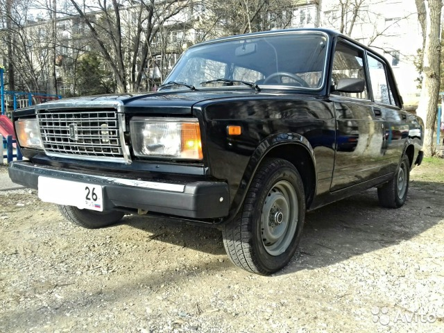

# Car classification


## Summary

<p>This application allows to carry out a multi-class classification of the car model by image. Classification is carried out according to the following 10 classes: "Lada Priora", "Ford Focus", "Lada 2114", "Lada 2107", "Lada Niva", "Lada Kalina", "Lada 2109", "Volkswagen Passat", "Lada 21099". The application presents a notebook for training a model. The basic idea for preparing a notebook is to take a pre-trained model and retrain it to perform the task of classifying a car by image.</p><br>


## Contents

* [Introduction](README.md#Introduction)
* [Project structure](README.md#Project-structure)
* [Instalation](README.md#Instalation)
* [Activation the virtual environment](README.md#Activation-env)
* [Loading data](README.md#Loading-data)
* [Training model](README.md#Training-model)
* [Inference](README.md#Inference)
* [Docker](README.md#Docker)
* [Client Server App](README.md#Client-Server-App)
* [Conclusions](README.md#Conclusions) <br><br>


## Introduction
<p>
The classification of cars by model is an actual problem and finds application in business and in ensuring safety. The solution of this problem with using machine learning models can be carried out if a lot of time is spent on classification, for example, when processing databases, or the object is in the field of view for a short time, which is not enough to identify the object. As an example, the recognizing of the number and model of the car in any application or during the operation of the security system.<br>

<p align="center">
  
  
</p>
<p align="center">
  
</p>

The task of developing an application includes task of training a machine learning model. To train the model, we will use photos from ads for the sale of cars that are in the public domain.

<p align="center">
  
  
  
</p>

<p align="center">
  
  
</p>

The analysis of similar images can lead to an error in human recognition. For example, some car models are generally similar and have slight differences. 

<p align="center">
  
  
</p>
<p align="center">
  
  
</p>

 This task was solved within the framework of [Kaggle competition](https://www.kaggle.com/competitions/sf-dl-car-classification).
</p><br>


## Project structure

<details>
<summary>Display project structure </summary> <br>

```Python
car_clf  
├── .gitignore  
├── .venv  
│   └── ...  
├── config  
│   └── data_config.json    ## congiguration file  
├── data  
│   ├── best_models         ## save best model during train
│   ├── inputs_for_train    ## folder for data
│   │   ├── test_upload     ## folder for test data
│   │   ├── train           ## folder for train data
│   │   ├── sample-submission.csv  ## ex file for kaggle submission
│   │   └── train.csv  
│   ├── outputs_from_train  ## folder for saved graph
│   ├── test_imgs_for_pred  ## folder with few samples in test_upload
│   └── sf-dl-car-classification.zip ## uploaded zip train dataset 
├── models                  ## folder for trained model
│   ├── weights_step_1.hdf5  
│   ├── ...  
│   └── weights_step_7.hdf5  
├── notebooks               ## notebook for create train models
│   ├── 01_notebook_train_model.ipynb  
│   ├── 02_colab_notebook_train_model.ipynb  ## colab notebook
│   └── 03_car-clf-nn-2021_OLD_ver.ipynb  
├── utils  
│   ├── __ init __.py  
│   ├── functions.py  
│   ├── functions_with_keras.py  
│   ├── generators.py  
│   ├── model.py  
│   ├── predictions.py  
│   └── read_config.py
├── client.py  
├── Dockerfile  
├── main.py  
├── readme.md  
├── requirements.txt  
└── server.py
```

</details>


## Instalation

<details>
<summary> Display how to install app </summary> <br>

<p> This section provides a sequence of steps for installing and launching the application. <br>

```Python
# 1. Clone repository
git clone https://github.com/ostrebko/car_clf.git

# 2. Go to the new directory:
cd car_clf

# 3. Activate the virtual environment in which you plan to launch the application (we will use VsCode)

# 4. Install requirements:
pip install -r requirements.txt

# 5. Create predicts of detection blastospores with main.py or create & run main.exe (in windows).
python main.py
```

</details>


## Activation env

<details>
<summary>Display how to create venv </summary> <br>

```Python
# Steps to activate the virtual environment in which you plan to launch the application in VsCode:
# 1. Run VS Code as an administrator, go to the project directory in PowerShell, execute the code below, the env folder containing the virtual environment files will appear
python -m venv .venv

# or you may tap -> Ctrl+Shift+P , then press -> Python: Select Interpreter (we use venv), choose 'Python 3.хх.хх ... Global' for create the virtual environment with GUI of VS Code.

# 2. To change the policy, in PowerShell type
Set-ExecutionPolicy -ExecutionPolicy RemoteSigned -Scope CurrentUser

# 3. Enter the environment folder (env), run the command
.venv/Scripts/Activate.ps1

# 4a. An environment marker (env) will appear at the beginning of the line in PowerShell, but VS Code may still not know anything about it. Press Ctrl+Shift+P, type Python: Select Interpreter
# Specify the desired path to python.exe in the env environment folder, this will be displayed at the bottom of the status bar. Now you can install modules only for a specific project.

# 4b. For VSCode, your Jupyter kernel is not necessarily using the same python interpreter you're using at the command line but if you have special libs you may need to using your notebook in created virtual environment.
# For using your notebook in created virtual environment install ipykernel:
pip install ipykernel
# then tap Ctrl+Shift+P to open the Command Palette, and select "Notebook: Select Notebook Kernel" ->
# -> Select another kernel -> Python Environments -> choose the interpreter you're using at the terminal (we create virtual environment with name: .venv)

# 5. If you need to exit, then execute deactivate in PowerShell, and return to global in the interpreter selection.
```

</details>


## Loading data

<details>
<summary> Display how to download data </summary> <br>

<p>Before training the model, it's necessary to download training dataset. **Attention**, it requires **1,66 Gb** of free disk spaces.</p>
<p>If you want to train the model in local machine, go to the [**Kaggle web page**](https://www.kaggle.com/competitions/sf-dl-car-classification/data/) in your browser and tap **Download All**, the file *'sf-dl-car-classification.zip'* will start downloading. Then move downloaded *'sf-dl-car-classification.zip'* in 'data' folder of the cloned project.</p>
<p>If you use notebook **'02_colab_notebook_train_model.ipynb'** for train model with Google Colab, you don't need to download data to local machine. Notebook consist cells with code to download *'sf-dl-car-classification.zip'* into cloned project in Goole Colab environment.</p>
<p>You also may to use Kaggle API to download -> *'kaggle competitions download -c sf-dl-car-classification'* 
(see. [Kaggle API in github](https://github.com/Kaggle/kaggle-api) ).</p>
<p>To unzip *'sf-dl-car-classification.zip'* into cloned project use the corresponding notebook cells.</p>

</details>


## Training model

<details>
<summary>Display description of steps training model </summary> <br>

<p>Basic steps of model preparation:</p>

1. Installing and importing the necessary libraries, functions and classes, fixing seed values, creating the necessary folders for data and saving results and unpacking the 'sf-dl-car-classification' archive.zip' (if not done earlier);  
Note: [Solving a possible error in Keras](https://discuss.tensorflow.org/t/using-efficientnetb0-and-save-model-will-result-unable-to-serialize-2-0896919-2-1128857-2-1081853-to-json-unrecognized-type-class-tensorflow-python-framework-ops-eagertensor/12518/9)  
2. Conducting a brief EDA, including analysis of available images;
3. Сreating a data augmentation object (using the **Albumentations** library) and creating data generators (using the **ImageDataAugmentor** library) to feed data in batches to the model during training;
4. The **Transfer-Learning** technique was used to create the model. As a basis, **EfficientNetB6** was loaded with the exception of fully connected layers (excluding the "head"). Instead of the excluded layers, fully connected layers were completed for our task. To create a model for training, the **ModelForTrain** class was written with a calling *build_model* method;  
5. The model training was based on the **Fine-Tuning** technique: the model training was carried out with gradual defrosting of the model layers and consisted of several steps (step):  
    **Step 1** - training of layer weights only for the "head", with constant EfficientNetB6 weights (after this step, the accuracy on the training sample exceeds 50%, on the test sample exceeds 60%). Since in the future the weights will be retrained when the model is defrosted, a small number of training epochs were selected at this stage. Note: The accuracy on the training sample turns out to be worse than the accuracy on the test sample, but by the 5th epoch, the accuracy of the test sample ceases to improve, and the accuracy of the training sample grows faster (see. Train history of accuracy and loss in Pic.1).<br>

    <p align="center">
      
      
    </p> 

    **Step 2-4** - training with gradual defrosting of body weights (i.e. layers of EfficientNetB6). Step 2: defrost 1/2 from all layers EfficientNetB6, training 10 epochs; Step 3: defrost 3/4 from all layers EfficientNetB6, training 10 epochs; Step 4: defrost all layers EfficientNetB6, training 10 epochs.<br> 
    Learning outcomes in steps 2-4:<br>
    The best convergence of the training and test samples is achieved after **Step 2** (defrosting 1/2 of all the layers of EfficientNetB6) at the 10th epoch and is slightly more than 90%. At this stage, you can try a larger number of epochs (30-50 epochs) with a gradual (according to the schedule or according to the condition of non-exaggeration of val_accuracy) decrease in the Learning Rate. But since in Colab the training time is limited by the amount of GPU usage time and the layers will be unfrozen further, respectively, the trained weights will still change, it was decided not to work in this direction.<br>

    <p align="center">
      
      
    </p> 

    At **step 3**, 3/4 of all layers was defrosted and 10 epochs trained.<br>

    <p align="center">
      
      
    </p> 

    At **step 4**, all base_model layers (all EfficientNetB6 layers) was defrosted and 10 epochs trained.<br>

    <p align="center">
      
      
    </p> 

    After **Step 3** the accuracy and loss of train and test dataset are diverge, but accuracy on test dataset has a better value than in the previous **Step 2** (see Pic.3). So we try to defrost all layers and train **Step 4**. After **Step 4** it can be seen that the accuracy and loss of train and test dataset are diverge less. The test accuracy continues to grow, and loss continues to continues to decrease. So it time to try **Step 5** to get better training results.<br>

    **Steps 5, 6, 7**: At these steps, in order to increase the accuracy of training the model, the size of the submitted images is increased by 2 times (from 224x228 to 448x448 dots). Learning occurs with all unfrozen layers, but the learning rate changes: **Step 5**: LR=1e-5, 8 epochs; **Step 6**: LR=1e-5, 6 epochs (cause Colab disabling GPU); **Step 7** LR=1e-6, 10 epochs. Note: On **Step 6**, it was decided to add 6 epochs without changing the parameters of **Step 5**.<br>
    It is important to note that when the image is enlarged by 2 times, the training time has increased by about 3-4 times and the training of 10 epochs of each step stretches to about 6.5 hours. Due to the fact that Google Colab has a limit on the operation of one session with the GPU, **Step 5** and **Step 6** were separated. If you can to train 20 epoch without stopping train, change: config.EPOCHS = 20 and skip **Step 6**.<br>
    At **Step 7**, the only *patience* parameter in the callback *ReduceLROnPlateau* was changed from 3 to 2.<br>

    6. To possibly improve the prediction quality of the model on a validation sample, the **Test Time Augmentations** technique was used, which is based on small changes in the validation sample data (augmentation of the validation sample) and averaging of the predictions obtained (small changes can help to the model correctly predict the image class).<br>

<p>To optimize the code, functions and classes were written, including:</p>

- recording the parameters used in data_config.json and it's import into a notebook;
- the function of creating data generators;
- model architecture definition class;
- the function of assembling the callbacks list when training the model;
- functions for saving and displaying accuracy and loss training graphs by epoch for analyzing the quality of model training;
- the function of saving the model to a separate project folder;
- the function of predicting the class of the photo (inference of the model) in demo mode and with manual input of the image path.

The results of the model prediction on the validation sample are presented in the file submission.csv.
Since when training the model, files are obtained in large volume (up to 450 MB), their weights are laid out in [cloud storage](https://drive.google.com/drive/folders/1myedVEqymkIYCOzOj18ChFHfSvswdRv1). To conduct training on a laptop or inference, they must be placed in the 'models' folder.<br>

Model training can be done in Google Colab. A notebook '02_colab_notebook_train_model.ipynb' has been prepared for the project for this purpose, with cloning the project and uploading training data to the Google Colab virtual environment.<br>

</details>


## Inference

<details>
<summary>General description </summary> <br>

<p>The term inference in this project means proving multi-classification of car images with trained model. The application gets to the entrance image, converts image to an array for feeding to the model input and makes a prediction with trained model.</p>  

<p>To carry out an inference perform in the terminal:</p>

```Python
python main.py
```

<p>Then follow the prompts and choose the mode of operation of the program: demonstration mode or manual input of the image path.</p>

</details>


## Docker
<details>

<summary> Display how to create and run docker image  </summary> <br>

```Python
# 1. Create a new image (its size is approximately 3.5 Gb)
docker build -t car_clf .

# 2. Run image in container.
docker run --rm -v $PWD/data/test_imgs_for_pred/:/data/test_imgs_for_pred  --name car_clf car_clf

# 3. The created container will be automatically deleted 
# after executing a sequence of commands from the Dockerfile.  
# Delete the container and image after usage
docker rmi car_clf
```
</details>


## Client Server App
<details>

<summary> Brief describe and display how to run client-server app </summary> <br>

The **client-server** application is developed using Flask.  
The **client.py** application accepts the image path (full or relative) as input. The image is read into a variable, then converted to bytes type data and then to string type. A post request (sending converted json data) is made to the local server (*http://localhost:5000*) with endpoint *'predict'*. After processing the request by the server, if the status code is 200, the client returns the predicted number and class name for the image, else return status code from server and message 'Check your request'.  

The **server.py** application implements:  

- loading a configuration file and a dictionary of paths;
- loading the trained model;
- processing of post-request data into a tensor accepted as input by the model;
- prediction of the number and class name of the car image;
- processing the post-request and sending a response to the client application.

The application is launched on the localhost:5000 with an endpoint *'/predict'*.

Steps to run **client-server** application:
- вefore running apps activate virtual environment (see sect. 'Activation env').
- run **server.py** application:

```Python
python server.py
```
- open another terminal and run **client.py** application:

```Python
python client.py
```
- input full img path or relative image path in this project
- to close server press *'CTRL+C'*

</details>


## Conclusions

<p>During the work on the project, an application that predicts the car model from the image (10 different classes of prediction are available in the project: "Lada Priora", "Ford Focus", "Lada 2114", "Lada 2107", "Lada Niva", "Lada Kalina", "Lada 2109", "Volkswagen Passat", "Lada 21099") was developed. The model, as well as the application itself, can be used as a basis for practical implementation in more complex applications and systems, for example, for database processing, for checking the license plate and model of cars, for security systems.</p>  

Using the method of gradual defrosting of layers allowed us to obtain the quality of the model on a test sample of more than 97%.


<p>To improve the model, you can try the following steps:</p>

1. Try other network architectures from SATA to ImageNet later B6, giving greater accuracy, for example ImageNetB7 or more accurate SOTA.
2. Experiment with the architecture of the "head" (for example, add 1-2 more fully connected layers).
3. Try more epochs at 5,6,7 stages of training (increase to 30 epochs with callback ReduceLROnPlateau with parameters monitor='val_accuracy', factor=0.2-0.5, patience=2-5).
4. Use external datasets to retrain the model.